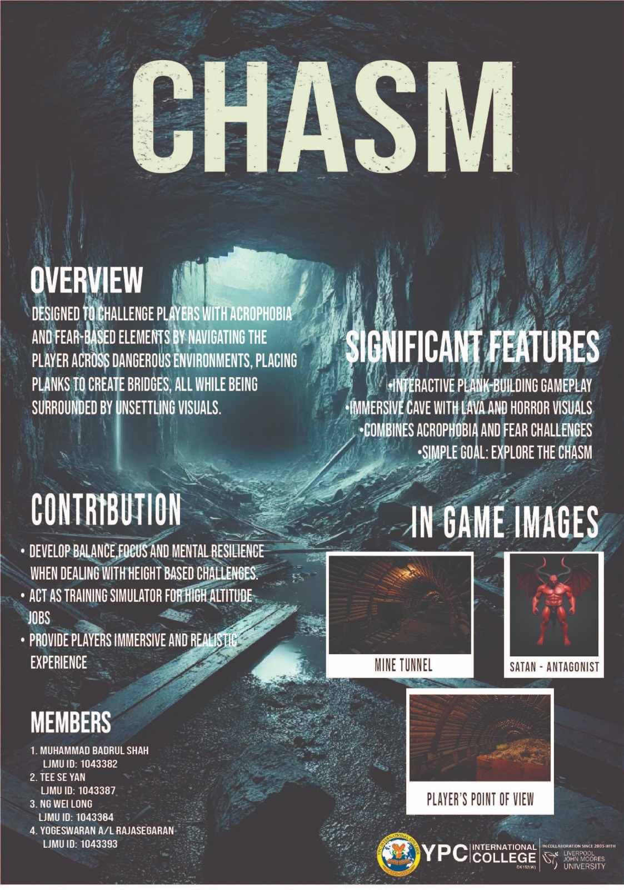
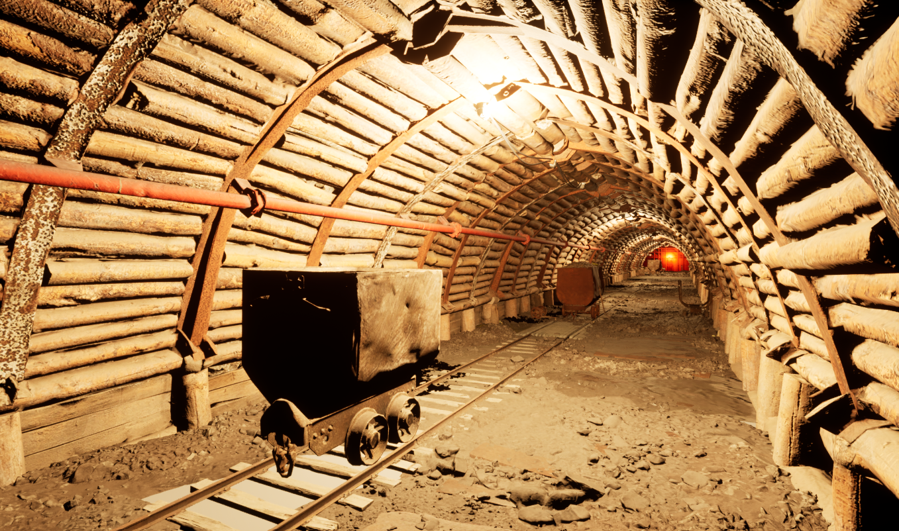
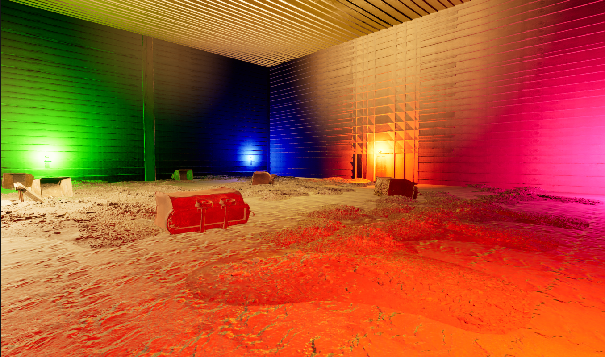
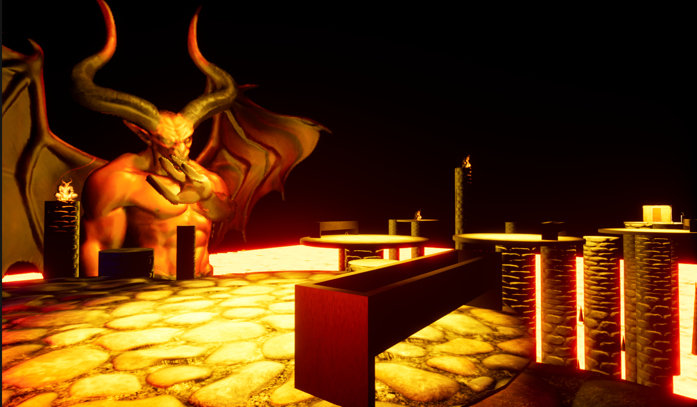
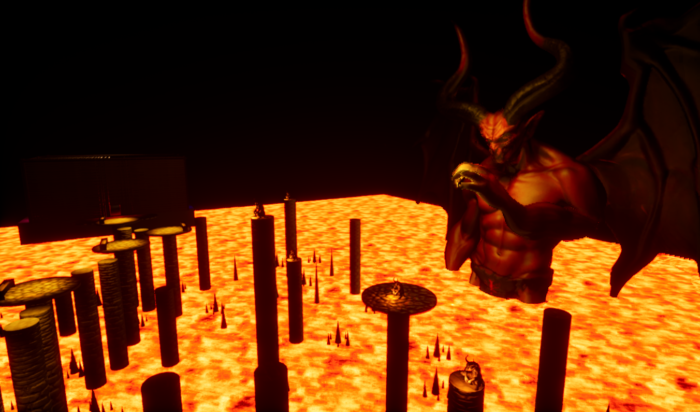
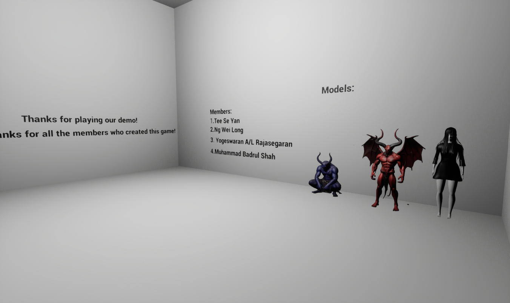

# Chasm – VR Horror Puzzle Experience

## Overview
Developed a VR horror puzzle experience featuring player movement, interactive mechanics and environmental systems such as lever-based logic and bridge-building gameplay using Unreal Engine 5.

---

## My Role
- Implemented player movement and VR input handling
- Developed interactive gameplay mechanics (lever, object interaction)
- Built environmental puzzle systems (bridge-building, progression flow)

---

## Core Systems

### Player Movement & Input
Handled VR input and player movement using Unreal Engine’s input system which enable smooth navigation and interaction within the environment.

### Interaction System
Implemented object interaction including lever activation and environment triggers which allow players to manipulate the world to progress.

### Puzzle Mechanics
Designed and implemented puzzle elements such as:
- Lever-based door unlocking
- Bridge-building using planks
- Conditional progression systems

---

## Challenges
- Working with limited VR hardware which require careful testing and iteration  
- Ensuring interaction systems remained stable and responsive  
- Implementing puzzle mechanics based on design requirements within a VR environment

---

## Tech Stack
- Unreal Engine 5  
- Blueprint  
- VR (Oculus)

---

## Media
- Poster

-Game Environment

